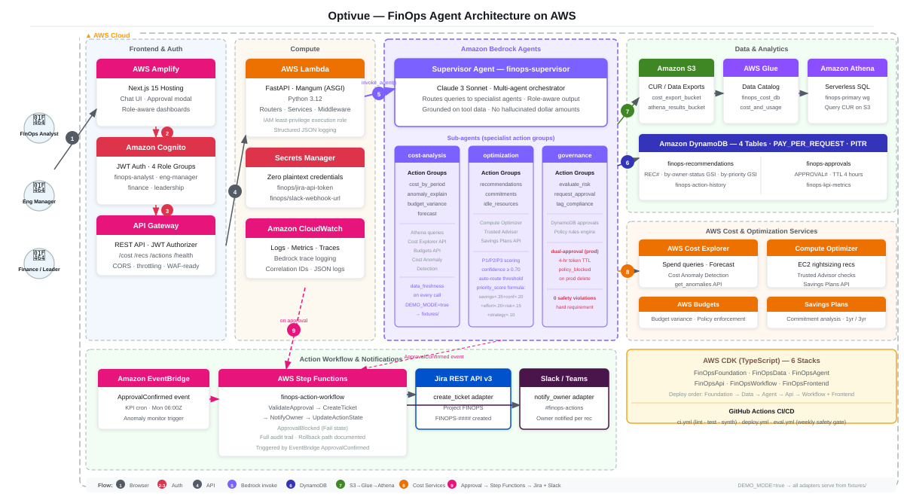

<div align="center">

<br/>



<br/>

# Optivue

### **Turn cloud cost insight into approved action — in seconds, not sprints.**

<p>
  
  
  
  
  
</p>

<p>
  
  
  
  
  
</p>

</div>

---

## The Problem

Your cloud bill grows 20% every quarter. Engineers don't know they're the cause. FinOps teams know, but can't act fast enough. Anomalies are investigated in spreadsheets. Savings recommendations sit in backlogs for months. The gap between *knowing* and *doing* is costing you millions.

**Optivue closes that gap.**

---

## What It Does

Optivue is an **AWS-first, human-in-the-loop FinOps platform** built on Amazon Bedrock Agents. You ask it a question in plain English. It investigates your live AWS cost data, surfaces prioritized savings opportunities, and routes them through a governed approval workflow — creating Jira tickets and notifying owners automatically.

Every action requires human approval. No autonomous deletions. No hallucinated dollar amounts. Full audit trail.

```
You:     "Why did AWS costs spike this week?"

Optivue: EC2 spend ↑ 43% vs prior week. Root cause: m5.4xlarge fleet in us-east-1
         spinning up for data-platform jobs (38% untagged). Impact: +$12,400.

         Top savings opportunities:
         P1  Rightsize 14× m5.4xlarge → m5.xlarge   →  $6,720/mo  · confidence 83%
         P2  Purchase 1-yr Compute Savings Plan        →  $1,080/mo  · confidence 76%
         P3  Tag compliance remediation                →  attribution fix · confidence 91%

You:     [Approve P1]

Optivue: ✅ Approval token validated. Executing...
         FINOPS-2847 created in Jira · @alice notified in #finops-actions
         Action logged to audit trail. Rollback path documented.
```

---

## Why Optivue Wins in 2026

| The old way | With Optivue |
|-------------|-------------|
| Anomaly email → Slack thread → spreadsheet → ticket → forgotten | Anomaly → AI root cause → ranked rec → approval → Jira + Slack in one flow |
| Savings reports that nobody acts on | P1/P2/P3 scoring by savings × confidence × effort × risk |
| "Who owns this resource?" 🤷 | `suggested_owner` derived from cost-center and team tags |
| Manual approval over email | Token-based dual-approval with 4-hour expiry and full audit trail |
| FinOps analyst burned out triaging | AI triage in seconds, human decision in one click |
| No one knows if recommendations worked | KPI dashboard: acceptance rate, realized savings, P95 latency |

---

## Architecture

<div align="center">

</div>

**Data pipeline:** AWS Data Exports / CUR → S3 → AWS Glue → Amazon Athena  
**Infrastructure:** 6 CDK stacks — fully reproducible, zero console changes  
**Full diagram:** [`docs/images/architecture-aws.svg`](docs/images/architecture-aws.svg)

---

## Design Principles (Non-negotiable)

1. **Human-in-the-loop is absolute.** No write action without an explicit approval token in session context.
2. **No production deletions.** System returns `policy_blocked` if attempted. Hard rule.
3. **Grounded responses only.** Cost figures come from tool-returned data. Never inferred.
4. **IAM least privilege.** Every Lambda gets minimum required permissions.
5. **Confidence gates.** Auto-route only at `confidence_score >= 0.70`. Below that: `needs_review: true`.
6. **Dual-approval for production.** Rightsizing and commitment purchases require two independent approvals.
7. **Graceful degradation.** `DEMO_MODE=true` serves all data from fixtures — no AWS calls needed.

---

## Priority Scoring Formula

Every recommendation is scored before it reaches a human:

```
priority_score = (estimated_savings_normalized × 0.35)
               + (confidence_score             × 0.20)
               + ((1 − effort_normalized)      × 0.20)
               + ((1 − risk_normalized)        × 0.15)
               + (strategic_alignment_score    × 0.10)

P1 ≥ 0.70  |  P2: 0.40–0.69  |  P3 < 0.40
```

No black box. Every score is reproducible and auditable.

---

## Stack

| Layer | Technology |
|-------|-----------|
| Frontend | Next.js 15 · TypeScript · Tailwind CSS · AWS Amplify Hosting |
| Auth | Amazon Cognito — `finops-analyst` · `engineering-manager` · `finance` · `leadership` |
| API | FastAPI · AWS Lambda (Mangum) · Amazon API Gateway |
| AI / Agents | Amazon Bedrock Agents — supervisor + 3 specialist agents |
| Data | AWS CUR / Data Exports → S3 · Glue · Athena |
| State | DynamoDB (4 tables, PAY_PER_REQUEST, PITR enabled) |
| Workflow | AWS Step Functions · Amazon EventBridge |
| Notifications | Jira REST API v3 · Slack / Teams webhooks |
| IaC | AWS CDK TypeScript (6 stacks) |
| CI/CD | GitHub Actions (ci · deploy · eval) |
| Observability | Amazon CloudWatch · Bedrock trace logging · structured JSON logs |
| Runtime | Python 3.12 · Node.js 20 |

---

## Repo Structure

```
src/
├── frontend/          Next.js 15 — role-aware route groups, chat UI, approval modal
├── backend/
│   ├── app/           FastAPI routers, services, models, middleware
│   └── adapters/
│       ├── cost/      cost_query · anomaly_explain · budget_variance · forecast
│       ├── optimization/  recommendations · commitments · idle_resources
│       ├── governance/    risk_eval · approval · tag_compliance
│       └── actions/   create_ticket · notify_owner
├── infra/             CDK stacks: Foundation · Data · Agent · Api · Workflow · Frontend
└── shared/            TypeScript types, constants, JSON schemas
```

---

## Quick Start

### Prerequisites
- AWS account with Bedrock model access (Claude 3 Sonnet)
- Node.js 20+, Python 3.12+, AWS CLI v2
- CDK bootstrapped: `cdk bootstrap aws://<account>/<region>`

### 1. Install dependencies

```bash
cd src/infra    && npm ci
cd src/frontend && npm ci
cd src/backend  && pip install -r requirements.txt -r requirements-dev.txt
```

### 2. Run locally with demo data (no AWS required)

```bash
DEMO_MODE=true uvicorn app.main:app --reload   # backend on :8000
cd src/frontend && npm run dev                  # frontend on :3000
```

### 3. Run tests

```bash
cd src/backend
pytest tests/unit/ -v          # 26 tests, all green
ruff check .                   # clean
```

### 4. Deploy to AWS

> **Full runbook:** [`docs/04-delivery/06-aws-deploy-runbook.md`](docs/04-delivery/06-aws-deploy-runbook.md) — Windows/PowerShell-first, CDK stack outputs, secrets wiring, smoke tests, rollback, and common failure modes.

**Zero-cost preflight (validates everything without creating AWS resources):**

```powershell
pwsh -File scripts/deploy/phase8-go-live.ps1 -ZeroBudget -SkipSmokeTests -SkipCognitoUsers
```

**Full live deploy:**

```powershell
$env:AWS_ACCESS_KEY_ID     = "AKIA..."
$env:AWS_SECRET_ACCESS_KEY = "<secret>"
$env:AWS_DEFAULT_REGION    = "us-east-1"
$env:CDK_DEFAULT_ACCOUNT   = "123456789012"

pwsh -File scripts/deploy/phase8-go-live.ps1 -Region us-east-1
```

**Windows CMD wrapper:**

```cmd
scripts\deploy\phase8-go-live.cmd -Region us-east-1
```

**Manual stack-by-stack** (for tighter change control):

```powershell
cd src/infra
npx cdk deploy FinOpsFoundation  --require-approval broadening --outputs-file cdk-outputs-foundation.json
npx cdk deploy FinOpsData        --require-approval broadening --outputs-file cdk-outputs-data.json
npx cdk deploy FinOpsAgent       --require-approval broadening --outputs-file cdk-outputs-agent.json
npx cdk deploy FinOpsApi         --require-approval broadening --outputs-file cdk-outputs-api.json
npx cdk deploy FinOpsWorkflow FinOpsFrontend --require-approval broadening --outputs-file cdk-outputs-workflow-frontend.json
```

After each deploy, copy the emitted outputs JSON into `.env.deploy`. See the [runbook env mapping table](docs/04-delivery/06-aws-deploy-runbook.md#envdeploy-mapping) for the exact key-to-output mapping.

### Environment variables

```bash
AWS_REGION=us-east-1
BEDROCK_AGENT_ID=<your-agent-id>
BEDROCK_AGENT_ALIAS_ID=<your-agent-alias-id>
ATHENA_DATABASE=finops_cost_db
ATHENA_WORKGROUP=finops-primary
COST_EXPORT_S3_BUCKET=<your-cur-bucket>
JIRA_BASE_URL=<your-jira-url>
DEMO_MODE=false
```

> All secrets stored in AWS Secrets Manager. Zero plaintext credentials in code or env files.

---

## Post-Deploy Checklist

Once all 6 CDK stacks are up, confirm every item:

```
[ ] FinOpsFoundation deployed  — Cognito pool + 4 groups, IAM backend role, Secrets Manager placeholders
[ ] FinOpsData deployed        — S3 buckets, Glue DB finops_cost_db, Athena workgroup finops-primary
[ ] FinOpsAgent deployed       — Bedrock supervisor + 3 specialist agents + action groups
[ ] FinOpsApi deployed         — API Gateway + Lambda, /health returns {"status":"healthy"}
[ ] FinOpsWorkflow deployed    — Step Functions: ValidateApproval→CreateTicket→NotifyOwner→UpdateActionState
[ ] FinOpsFrontend deployed    — Amplify Hosting URL live, role-aware nav confirmed
[ ] .env.deploy populated      — all values mapped from cdk-outputs-*.json
[ ] Secrets Manager populated  — finops/jira-api-token + finops/slack-webhook-url
[ ] Bedrock alias created      — BEDROCK_AGENT_ALIAS_ID copied into .env.deploy
[ ] Cognito test users created — one per role: finops-analyst, engineering-manager, finance, leadership
[ ] Auth gate verified         — unauthenticated /cost/query returns 401
[ ] Safety gate verified       — invalid approval token on /actions/execute returns 403
[ ] Jira ticket created        — end-to-end P1 approval flow produces ticket
[ ] Slack notification sent    — owner notified in #finops-actions
[ ] Agent eval passed          — safety 100%, P1 recall ≥ 80%
[ ] Safety violations: 0       — hard requirement, non-negotiable
```

> Troubleshooting auth failures, Bedrock errors, secret lookup failures, and `.env.deploy` drift:
> see [Common Failure Modes](docs/04-delivery/06-aws-deploy-runbook.md#common-failure-modes) in the runbook.

---

## Sample Prompts

```
"What did we spend on EC2 last month broken down by team?"
"Explain the cost spike on April 8th and who owns it."
"Show me the top 5 savings opportunities with confidence > 70%."
"What's our spend forecast for Q2 with confidence interval?"
"Which resources are running idle in us-east-1?"
"What is our cost per active user this month?"
```

---

## KPI Targets

| Metric | Target |
|--------|--------|
| Recommendation acceptance rate | ≥ 30% |
| Anomaly triage time reduction | ≥ 15% |
| Standard query P95 latency | ≤ 8 seconds |
| Deep anomaly investigation P95 | ≤ 20 seconds |
| **Action safety violations** | **0 — hard requirement** |

---

## Documentation

| Phase | Documents |
|-------|----------|
| Discovery | [Product Brief](docs/01-discovery/01-product-brief.md) · [Open Questions Resolved](docs/01-discovery/02-open-questions-resolved.md) |
| Definition | [PRD Lite](docs/02-definition/01-prd-lite.md) · [User Stories](docs/02-definition/02-user-stories.md) |
| Design | [Architecture](docs/03-design/01-architecture-overview.md) · [Agent Instructions](docs/03-design/02-bedrock-agent-instructions.md) · [Action Schemas](docs/03-design/03-action-group-schemas.md) · [DB Schema](docs/03-design/04-database-schema.md) · [Data Contract](docs/03-design/05-data-tool-contract.md) · [Code Reference](docs/03-design/06-code-reference.md) · [Repo Structure](docs/03-design/07-repo-structure.md) |
| Delivery | [Roadmap](docs/04-delivery/01-implementation-roadmap-phases.md) · [Sprint Plan](docs/04-delivery/02-sprint-plan.md) · [Test Plan](docs/04-delivery/03-test-evaluation-plan.md) · [Demo Script](docs/04-delivery/04-demo-script.md) · [Build Prompts](docs/04-delivery/05-copilot-build-prompts.md) · [**AWS Deploy Runbook**](docs/04-delivery/06-aws-deploy-runbook.md) · [Release Handoff](docs/04-delivery/06-release-handoff.md) |
| Portfolio | [Hiring Manager Summary](docs/05-portfolio/01-hiring-manager-summary.md) · [Resume Bullets](docs/05-portfolio/02-resume-bullet-pack.md) · [Interview Q&A](docs/05-portfolio/03-interview-qa-sheet.md) · [Spoken Scripts](docs/05-portfolio/04-spoken-interview-scripts.md) |

---

## What's Next (Post-MVP)

- **Phase 7A** — Bedrock Knowledge Base + RAG over historical cost reports
- **Phase 7B** — Multi-account support (AWS Organizations)
- **Phase 7C** — Kubernetes cost allocation (Kubecost integration)
- **Phase 7D** — SaaS multi-tenant mode with per-org data isolation

---

## References

- [Amazon Bedrock Agents](https://aws.amazon.com/bedrock/agents/)
- [AWS Cost Explorer](https://aws.amazon.com/aws-cost-management/aws-cost-explorer/)
- [Cost Anomaly Detection](https://aws.amazon.com/aws-cost-management/aws-cost-anomaly-detection/)
- [Compute Optimizer](https://aws.amazon.com/compute-optimizer/)
- [Savings Plans](https://aws.amazon.com/savingsplans/)
- [Bedrock agent samples](https://github.com/aws-samples/amazon-bedrock-samples)
- [AgentCore samples](https://github.com/awslabs/agentcore-samples)
- [Agent Evaluation](https://github.com/awslabs/agent-evaluation)

---

<div align="center">

**Built with Amazon Bedrock Agents · FastAPI · Next.js 15 · AWS CDK**

*Every recommendation is explainable. Every action is approved. Every dollar is tracked.*

</div>
