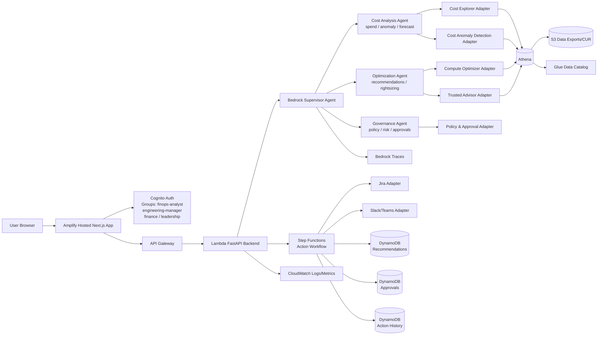

# FinOps Agent MVP Architecture Diagram

```mermaid
flowchart LR
  U[User Browser] --> A[Amplify Hosted Next.js App]
  A --> C[Cognito Auth\nGroups: finops-analyst\nengineering-manager\nfinance / leadership]
  A --> G[API Gateway]
  G --> F[Lambda FastAPI Backend]

  F --> SUP[Bedrock Supervisor Agent]

  SUP --> CA[Cost Analysis Agent\nspend / anomaly / forecast]
  SUP --> OA[Optimization Agent\nrecommendations / rightsizing]
  SUP --> GOV[Governance Agent\npolicy / risk / approvals]

  CA --> T1[Cost Explorer Adapter]
  CA --> T2[Cost Anomaly Detection Adapter]
  OA --> T3[Compute Optimizer Adapter]
  OA --> T4[Trusted Advisor Adapter]
  GOV --> T5[Policy & Approval Adapter]

  T1 --> D[(Athena)]
  T2 --> D
  T3 --> D
  T4 --> D

  D --> S[(S3 Data Exports/CUR)]
  D --> GL[Glue Data Catalog]

  F --> WF[Step Functions\nAction Workflow]
  WF --> J[Jira Adapter]
  WF --> N[Slack/Teams Adapter]
  WF --> DB1[(DynamoDB\nRecommendations)]
  WF --> DB2[(DynamoDB\nApprovals)]
  WF --> DB3[(DynamoDB\nAction History)]

  F --> CW[CloudWatch Logs/Metrics]
  SUP --> TR[Bedrock Traces]
```
